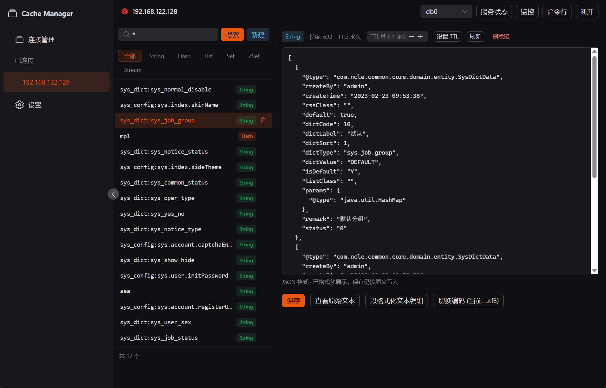
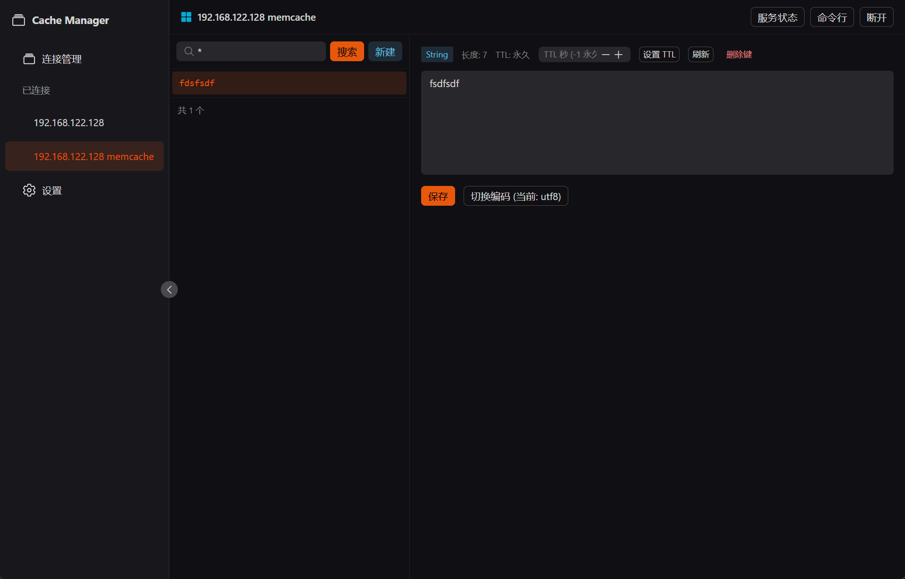
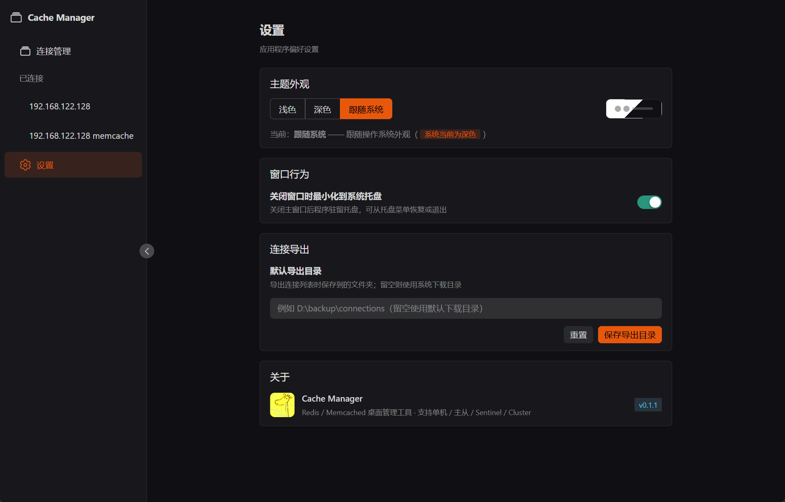
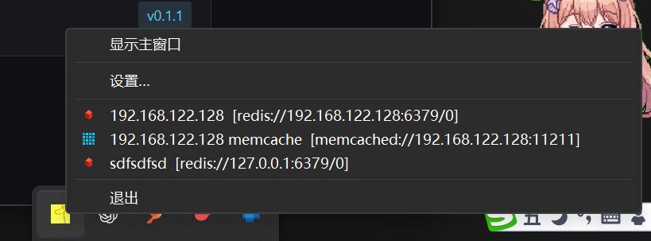

# Cache Manager 管理工具

> 💡 **本项目全程使用 [pi agent](https://github.com/earendil-works/pi) + DeepSeek V4 Flash 进行开发**

[English](README.en.md) | **中文**

基于 **Tauri 2 + Rust + Vue 3** 的桌面缓存管理工具，同时支持 **Redis** 与 **Memcached**。
Redis 支持 **单机 / 主从 / Sentinel / Cluster** 四种部署模式。

  

## 功能特性

### 连接管理
- 支持 **Redis**（单机 / 主从 / Sentinel 哨兵 / Cluster 集群）与 **Memcached** 两种类型
- 支持 ACL 用户名 / 密码认证、TLS/SSL、连接超时配置
- 连接配置本地持久化（`%APPDATA%/com.cachemanager.app/connections.json`）
- 一键测试连接、多连接并行管理
- **连接列表导入 / 导出**：导出为 JSON 文件，可跨机器迁移；导入时自动跳过 host:port 一致的重复配置
- 系统托盘快速连接已保存的连接（点击即连接并打开）

### 键空间浏览器
- Redis：`SCAN` 游标分页浏览，支持 pattern 搜索与类型过滤（String/Hash/List/Set/ZSet/Stream），集群模式下自动跨节点扫描合并
- Memcached：通过 `stats items` + `stats cachedump` 枚举全部键（老版本自动回退 `lru_crawler metadump`）
- **本地模糊查询**：Memcached 键列表在本地过滤，输入任意子串即时模糊匹配（支持 `*` / `?` 通配符），不重复请求服务器
- 键信息：类型、TTL、长度、内存占用
- 主从模式下可从 **从库** 读取（读写分离），UI 上切换主/从节点
- 键列表项悬停可**删除键**（确认弹窗）

### 值查看与编辑
- **String**：文本/Base64 编码切换编辑，支持 TTL；JSON 值自动格式化高亮展示
- **Hash**：字段列表，新增/删除字段（大哈希自动 `HSCAN` 分页）
- **List**：元素列表，`LPUSH`/`RPUSH` 追加、按值删除
- **Set**：成员列表，增删
- **ZSet**：成员+分数，增删
- **Stream**：条目列表，`XADD`/`XDEL`
- 二进制安全：非 UTF-8 内容自动 Base64 显示
- 支持创建六种类型的新键，值编辑面板内可直接删除当前键

### 命令行控制台
- 执行任意 Redis / Memcached 命令（支持带引号的参数解析）
- Memcached 模式下 `set` 命令智能补全（简写 `set key value [exptime]` 自动转完整协议）
- 响应以 JSON 格式化展示，标量值直接显示文本
- 命令历史（↑↓ 切换）、执行耗时统计

### 服务器管理
- **INFO**：分节展示（server/memory/clients/replication/keyspace…）
- **CONFIG**：查询与修改配置
- **CLIENT LIST**：客户端连接列表
- **SLOWLOG**：慢日志查询
- **拓扑视图**：主从/集群/哨兵节点状态一览

### 实时监控
- **Pub/Sub 订阅**：订阅频道/模式，实时推送消息，支持发布
- **MONITOR**：实时显示服务器收到的全部命令（单机/主从模式）

### 系统托盘与设置
- 关闭窗口时**最小化到系统托盘**（不退出，常驻后台）
- 托盘菜单：显示主窗口、**已保存连接的快速连接**（带 Redis/Memcached 类型图标）、退出
- 独立设置页面（托盘可直达）：**浅色 / 深色 / 跟随系统** 三档主题、关闭行为、**默认导出目录**
- 单实例运行（重复启动自动聚焦已有窗口）

## 界面预览

| Redis 数据浏览 | Memcached 数据浏览 |
| --- | --- |
|  |  |

| 设置页面 | 系统托盘 |
| --- | --- |
|  |  |

## 技术架构

```
┌─────────────────────────────┐
│   Vue 3 + Naive UI 前端       │  Tauri IPC (invoke / Channel)
└──────────────┬──────────────┘
               │
┌──────────────▼──────────────┐
│   Rust 后端 (tauri commands)  │
│  ┌────────────────────────┐  │
│  │ RedisManager (连接池管理)│  │
│  │  - Single / MasterSlave│  │
│  │  - Sentinel / Cluster  │  │
│  │ keys / console / server │  │
│  │ pubsub / monitor        │  │
│  └───────────┬────────────┘  │
│  ┌───────────▼────────────┐  │
│  │ MemcachedManager       │  │
│  │ (自实现文本协议, tokio)  │  │
│  └───────────┬────────────┘  │
└──────────────┼──────────────┘
        ┌──────▼──────┐
        │  fred (Redis │
        │  client)     │
        └─────────────┘
```

- **Redis 客户端**：[fred](https://github.com/redis-rs/fred) v10 — 原生支持单机、集群（自动发现/槽位路由/MOVED 重定向）、哨兵（主节点发现/故障转移）、主从复制
- **Memcached**：自实现文本协议（`memcachedx.rs`，tokio `TcpStream`，零第三方依赖）
- **协议**：RESP3（自动回退 RESP2），二进制安全
- **连接池**：每连接独立 `RedisPool`，主从模式为从库建立独立连接池

## 快速开始

### 环境要求
- [Node.js](https://nodejs.org) ≥ 18
- [Rust](https://www.rust-lang.org) ≥ 1.77（含对应平台工具链）
- [Tauri 2 前置依赖](https://v2.tauri.app/start/prerequisites/)

### 开发运行

```bash
npm install
npm run tauri dev
```

### 构建发布包（免安装单文件）

```bash
npm run tauri build
```

构建产物为 **免安装单文件** `src-tauri/target/release/cache-manager.exe`（已复制到 `release/CacheManager.exe`），
双击即可运行，无需安装、无需额外依赖（仅需 Windows 10/11 自带的 WebView2 运行时）。

> 版本号：当前版本 **v0.1.1**。版本号统一维护在三处（保持一致）：`Cargo.toml` / `tauri.conf.json` / `package.json`。
> 构建后 exe 的右键属性 → 详细信息会自动显示文件版本/产品版本（由 tauri-build 从 `Cargo.toml` 写入 VERSIONINFO 资源）。

### 运行测试

后端包含针对真实 Redis 的冒烟测试（默认 `127.0.0.1:6379`）：

```bash
# 单机模式
cargo test --test smoke
# 主从模式（master:6380, replica:6381）
cargo test --test master_slave
# 哨兵模式（sentinel:26379, master:6380）
cargo test --test sentinel
# 集群模式（3 节点 7000-7002）
cargo test --test cluster
# URL 构建单元测试
cargo test --test url_build
```

## 项目结构

```
├── src/                        # Vue 3 前端
│   ├── api/                    # Tauri invoke 封装
│   ├── components/             # ConnectionForm / ValueEditor
│   ├── views/                  # Connections / Explorer / Console / ServerInfo / Monitor / Settings
│   ├── store/                  # Pinia 连接状态
│   ├── router/                 # 路由
│   └── types.ts                # 与后端 DTO 对应的类型
├── src-tauri/
│   ├── src/
│   │   ├── commands.rs         # Tauri 命令层（薄封装，模式路由）
│   │   ├── redisx/
│   │   │   ├── mod.rs          # 连接管理器、URL 构建、模式路由
│   │   │   ├── keys.rs         # 键扫描/值读写
│   │   │   ├── console.rs      # 任意命令执行
│   │   │   ├── server.rs       # INFO/CONFIG/CLIENTS/SLOWLOG/拓扑
│   │   │   └── stream.rs       # Pub/Sub + MONITOR
│   │   ├── memcachedx.rs       # Memcached 文本协议实现（零依赖）
│   │   ├── model.rs            # 连接配置模型
│   │   ├── store.rs            # 配置/设置持久化
│   │   ├── tray.rs             # 系统托盘（快速连接 + 图标）
│   │   ├── single_instance.rs  # 单实例端口锁
│   │   └── error.rs            # 统一错误类型
│   └── tests/                  # 冒烟测试（单机/主从/哨兵/集群）
└── scripts/gen_icon.py         # 图标生成脚本
```

## 模式说明

| 模式 | 连接方式 | 支持的操作 |
|------|---------|-----------|
| 单机 | 直接连接 | 全部功能 |
| 主从 | 主库可读写；从库可浏览/读取（UI 切换） | 全部功能；从库只读 |
| 哨兵 | 通过 Sentinel 发现主节点，支持故障转移 | 全部功能；拓扑显示哨兵/主从状态 |
| 集群 | 种子节点自动发现，槽位路由，支持 MOVED 重定向 | 全部功能；跨节点 SCAN |
| Memcached | 直接连接（文本协议） | 键浏览/模糊查询/值编辑/命令行/删除/TTL |

## 注意事项
- MONITOR 命令仅支持单机/主从模式（Redis 限制）
- 集群模式不支持 `SELECT`（Redis Cluster 仅 db0）
- 大键（>5000 元素）查看时自动分页并标记截断
- Memcached 键枚举依赖 `stats items` / `stats cachedump`（服务端默认开启），被禁用时自动回退 `lru_crawler metadump`
- 连接导入以 **host:port** 判断重复，重复配置自动跳过
