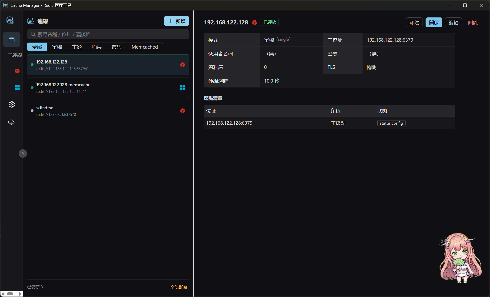
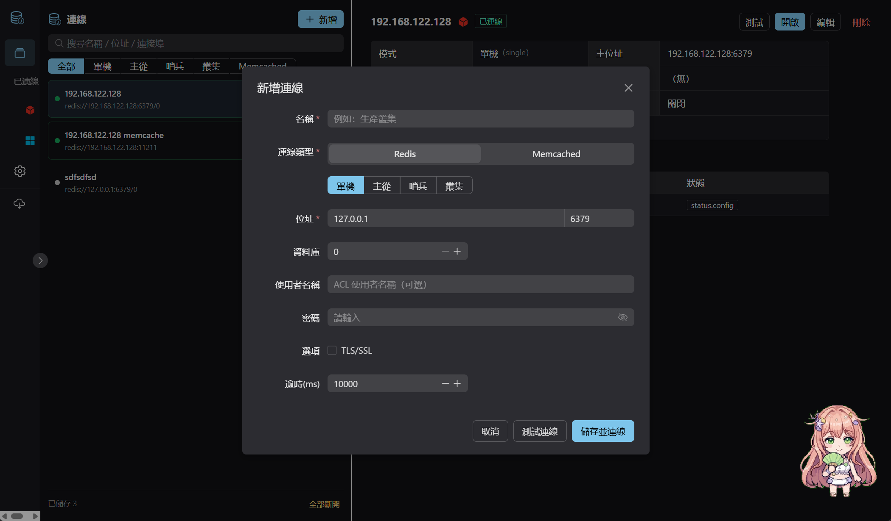
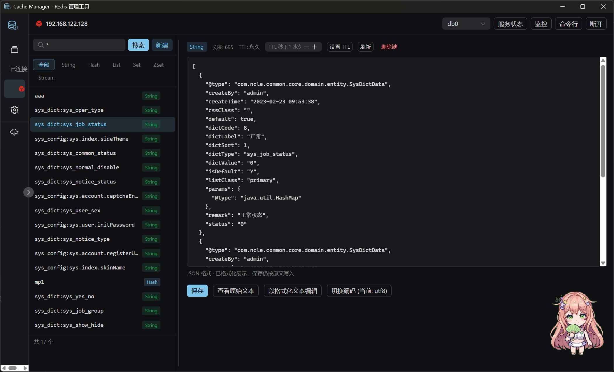
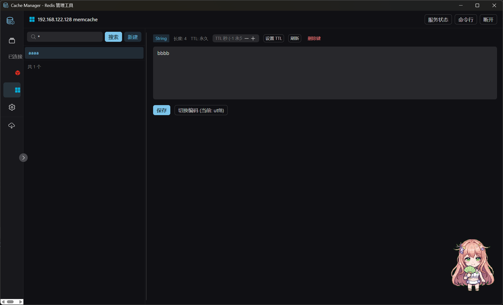
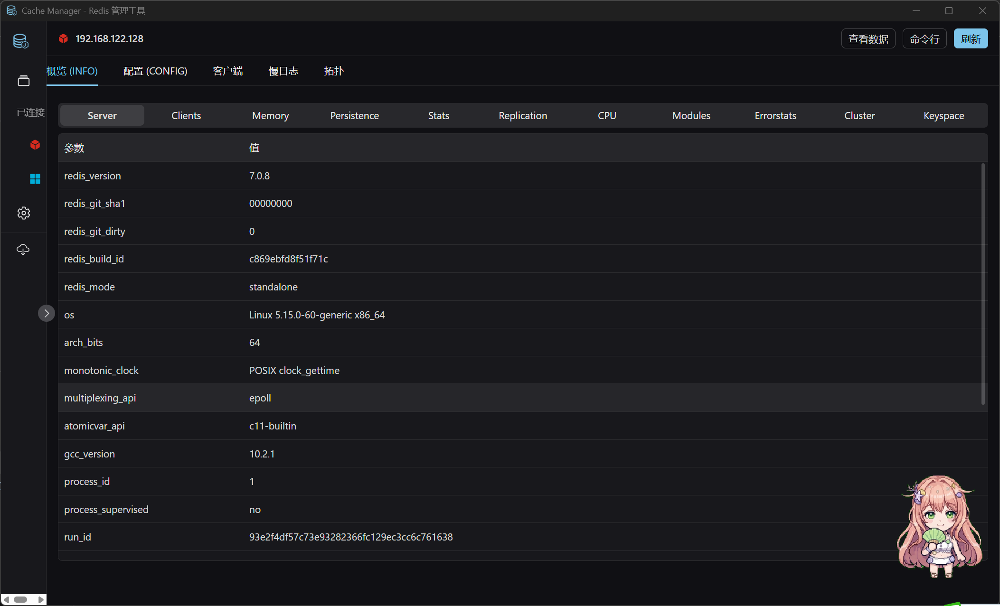
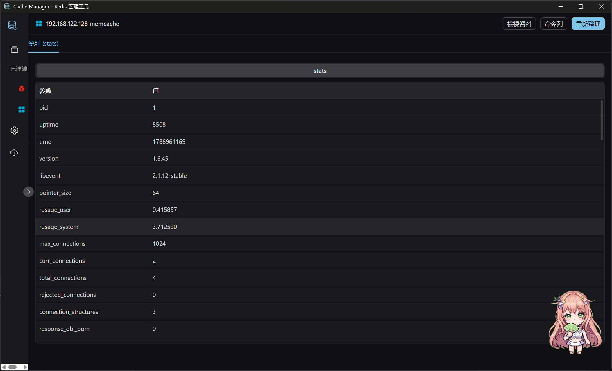
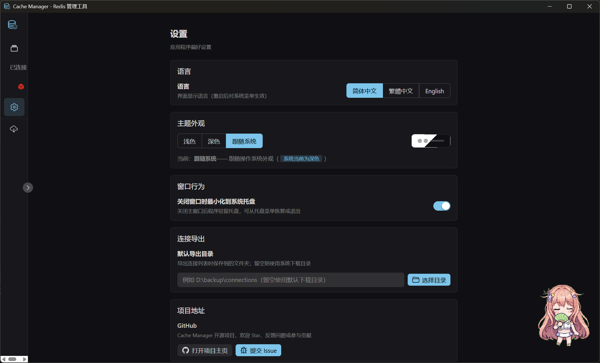

# Cache Manager 管理工具

> 💡 **本專案全程使用 [pi agent](https://github.com/earendil-works/pi) + DeepSeek V4 Flash 進行開發**

[English](README.md) | [简体中文](README.zh-CN.md) | **繁體中文**

基於 **Tauri 2 + Rust + Vue 3** 的跨平台桌面快取管理工具，同時支援 **Redis** 與 **Memcached**。
Redis 支援 **單機 / 主從 / Sentinel / Cluster** 四種部署模式。

  

## 功能特性

### 連線管理
- 支援 **Redis**（單機 / 主從 / Sentinel 哨兵 / Cluster 叢集）與 **Memcached** 兩種類型
- 支援 ACL 使用者名稱 / 密碼認證、TLS/SSL、連線逾時設定
- 連線設定本地持久化（`%APPDATA%/com.cachemanager.app/connections.json`）
- 一鍵測試連線、多連線並行管理
- 系統托盤快速連線已儲存的連線（點擊即連線並開啟）

### 鍵空間瀏覽器
- Redis：`SCAN` 游標分頁瀏覽，支援 pattern 搜尋與類型篩選（String/Hash/List/Set/ZSet/Stream），叢集模式下自動跨節點掃描合併
- Memcached：透過 `stats items` + `stats cachedump` 列舉全部鍵（舊版本自動回退 `lru_crawler metadump`）
- **本地模糊查詢**：Memcached 鍵清單在本地篩選，輸入任意子字串即時模糊比對（支援 `*` / `?` 萬用字元），不重複請求伺服器
- 鍵資訊：類型、TTL、長度、記憶體占用
- 主從模式下可從 **從庫** 讀取（讀寫分離），UI 上切換主/從節點
- 鍵清單項目懸停可**刪除鍵**（確認彈窗）

### 值檢視與編輯
- **String**：文字/Base64 編碼切換編輯，支援 TTL；JSON 值自動格式化高亮顯示
- **Hash**：欄位清單，新增/刪除欄位（大雜湊自動 `HSCAN` 分頁）
- **List**：元素清單，`LPUSH`/`RPUSH` 追加、依值刪除
- **Set**：成員清單，增刪
- **ZSet**：成員+分數，增刪
- **Stream**：條目清單，`XADD`/`XDEL`
- 二進位安全：非 UTF-8 內容自動 Base64 顯示
- 支援建立六種類型的新鍵，值編輯面板內可直接刪除目前鍵

### 命令列主控台
- 執行任意 Redis / Memcached 指令（支援帶引號的參數解析）
- Memcached 模式下 `set` 指令智慧補全（簡寫 `set key value [exptime]` 自動轉完整協定）
- 回應以 JSON 格式化顯示，純量值直接顯示文字
- 指令歷史（↑↓ 切換）、執行耗時統計

### 伺服器管理
- **INFO**：分節顯示（server/memory/clients/replication/keyspace…）
- **CONFIG**：查詢與修改設定
- **CLIENT LIST**：用戶端連線清單
- **SLOWLOG**：慢查詢日誌
- **拓撲檢視**：主從/叢集/哨兵節點狀態一覽

### 即時監控
- **Pub/Sub 訂閱**：訂閱頻道/模式，即時推送訊息，支援發布
- **MONITOR**：即時顯示伺服器收到的全部指令（單機/主從模式）

### 設定與體驗
- **简体中文 / 繁體中文 / English** 介面，設定頁或系統托盤一鍵切換語言
- **淺色 / 深色 / 跟隨系統** 三檔主題
- **新版本自動檢查**：側邊欄 logo 右上角呼吸燈徽章提醒（點擊直達 Releases 頁）
- 連線資訊與詳情面板可拖動調寬
- 關閉視窗時**最小化到系統托盤**（不退出，常駐背景）
- 托盤選單：顯示主視窗、**已儲存連線的快速連線**（帶 Redis/Memcached 類型圖示）、語言切換、檢查更新、結束
- 單一實例執行（重複啟動自動聚焦既有視窗）

## 介面預覽

| 連線清單 | 新增連線 |
| --- | --- |
|  |  |

| Redis 資料瀏覽 | Memcached 資料瀏覽 |
| --- | --- |
|  |  |

| Redis 伺服器資訊 | Memcached 伺服器資訊 |
| --- | --- |
|  |  |

| 設定頁面 |
| --- |
|  |

## 技術架構

```
┌─────────────────────────────┐
│   Vue 3 + Naive UI 前端       │  Tauri IPC (invoke / Channel)
└──────────────┬──────────────┘
               │
┌──────────────▼──────────────┐
│   Rust 後端 (tauri commands)  │
│  ┌────────────────────────┐  │
│  │ RedisManager (連線池管理)│  │
│  │  - Single / MasterSlave│  │
│  │  - Sentinel / Cluster  │  │
│  │ keys / console / server │  │
│  │ pubsub / monitor        │  │
│  └───────────┬────────────┘  │
│  ┌───────────▼────────────┐  │
│  │ MemcachedManager       │  │
│  │ (自實作文字協定, tokio)  │  │
│  └───────────┬────────────┘  │
└──────────────┼──────────────┘
        ┌──────▼──────┐
        │  fred (Redis │
        │  client)     │
        └─────────────┘
```

- **Redis 用戶端**：[fred](https://github.com/redis-rs/fred) v10 — 原生支援單機、叢集（自動發現/槽位路由/MOVED 重新導向）、哨兵（主節點發現/故障轉移）、主從複製
- **Memcached**：自實作文字協定（`memcachedx.rs`，tokio `TcpStream`，零第三方依賴）
- **協定**：RESP3（自動回退 RESP2），二進位安全
- **連線池**：每連線獨立 `RedisPool`，主從模式為從庫建立獨立連線池

## 快速開始

### 環境需求
- [Node.js](https://nodejs.org) ≥ 18
- [Rust](https://www.rust-lang.org) ≥ 1.77（含對應平台工具鏈）
- [Tauri 2 前置依賴](https://v2.tauri.app/start/prerequisites/)

### 開發執行

```bash
npm install
npm run tauri dev
```

### 使用 just 快速指令（推薦）

[just](https://github.com/casey/just) 已用於統一常用開發指令，安裝 just 後：

```bash
just dev       # 除錯執行（熱重載）
just build     # 發布建置（免安裝單檔 exe）
just release   # 產生發布產物（exe + 原始碼包 + hash + git tag）
just typecheck # 前端型別檢查
just test      # 後端單元測試
```

執行 `just --list` 查看全部指令（建置 / 測試 / 圖示產生等）。

> **跨平台**：justfile 相容 macOS / Linux / Windows。Windows 需安裝 [Git for Windows](https://git-scm.com) 且將 `Git\bin` 加入 PATH（提供 `sh`，just 依賴它執行指令）；macOS / Linux 開箱即用。

### 建置發布包（免安裝單檔）

```bash
npm run tauri build
```

建置產物為 **免安裝單檔** `src-tauri/target/release/cache-manager.exe`（已複製到 `release/CacheManager.exe`），
雙擊即可執行，無需安裝、無需額外依賴（僅需 Windows 10/11 內建的 WebView2 執行階段）。

> 版本號：目前版本 **v0.1.2**。版本號統一維護在三處（保持一致）：`Cargo.toml` / `tauri.conf.json` / `package.json`。
> 建置後 exe 的右鍵屬性 → 詳細資料會自動顯示檔案版本/產品版本（由 tauri-build 從 `Cargo.toml` 寫入 VERSIONINFO 資源）。

### 發布產物（`just release`）

```bash
just build    # 先建置 exe
just release  # 產生發布產物
```

產生到 `release/` 目錄：

```
CacheManager-0.1.2.exe        # 帶版本號的免安裝 exe
CacheManager-0.1.2.exe.md5    # exe 的 MD5 校驗
CacheManager-0.1.2.exe.sha1   # exe 的 SHA1 校驗
source-0.1.2.tar.gz           # 原始碼包（排除 node_modules/target/.git/release/dist 等）
source-0.1.2.tar.gz.md5       # 原始碼包 MD5
source-0.1.2.tar.gz.sha1      # 原始碼包 SHA1
```

同時會建立並推送對應版本號的 git tag（`v0.1.2`，已存在時自動跳過）。

### 執行測試

後端包含針對真實 Redis 的冒煙測試（預設 `127.0.0.1:6379`）：

```bash
# 單機模式
cargo test --test smoke
# 主從模式（master:6380, replica:6381）
cargo test --test master_slave
# 哨兵模式（sentinel:26379, master:6380）
cargo test --test sentinel
# 叢集模式（3 節點 7000-7002）
cargo test --test cluster
# URL 建置單元測試
cargo test --test url_build
```

## 專案結構

```
├── src/                        # Vue 3 前端
│   ├── api/                    # Tauri invoke 封裝
│   ├── components/             # ConnectionForm / ValueEditor / TrayBridge
│   ├── views/                  # Connections / Explorer / Console / ServerInfo / Monitor / Settings
│   ├── store/                  # Pinia 連線狀態
│   ├── router/                 # 路由
│   ├── i18n/                   # 多語言（zh-CN / zh-TW / en）
│   └── types.ts                # 與後端 DTO 對應的型別
├── src-tauri/
│   ├── src/
│   │   ├── commands.rs         # Tauri 指令層（薄封裝，模式路由）
│   │   ├── redisx/
│   │   │   ├── mod.rs          # 連線管理器、URL 建置、模式路由
│   │   │   ├── keys.rs         # 鍵掃描/值讀寫
│   │   │   ├── console.rs      # 任意指令執行
│   │   │   ├── server.rs       # INFO/CONFIG/CLIENTS/SLOWLOG/拓撲
│   │   │   └── stream.rs       # Pub/Sub + MONITOR
│   │   ├── memcachedx.rs       # Memcached 文字協定實作（零依賴）
│   │   ├── model.rs            # 連線設定模型
│   │   ├── store.rs            # 設定/設定持久化
│   │   ├── tray.rs             # 系統托盤（快速連線 + 語言 + 檢查更新）
│   │   ├── single_instance.rs  # 單一實例連接埠鎖
│   │   └── error.rs            # 統一錯誤型別
│   └── tests/                  # 冒煙測試（單機/主從/哨兵/叢集）
└── scripts/gen_icon.py         # 圖示產生腳本
```

## 模式說明

| 模式 | 連線方式 | 支援的操作 |
|------|---------|-----------|
| 單機 | 直接連線 | 全部功能 |
| 主從 | 主庫可讀寫；從庫可瀏覽/讀取（UI 切換） | 全部功能；從庫唯讀 |
| 哨兵 | 透過 Sentinel 發現主節點，支援故障轉移 | 全部功能；拓撲顯示哨兵/主從狀態 |
| 叢集 | 種子節點自動發現，槽位路由，支援 MOVED 重新導向 | 全部功能；跨節點 SCAN |
| Memcached | 直接連線（文字協定） | 鍵瀏覽/模糊查詢/值編輯/指令列/刪除/TTL |

## 注意事項
- MONITOR 指令僅支援單機/主從模式（Redis 限制）
- 叢集模式不支援 `SELECT`（Redis Cluster 僅 db0）
- 大鍵（>5000 元素）檢視時自動分頁並標記截斷
- Memcached 鍵列舉依賴 `stats items` / `stats cachedump`（伺服器預設開啟），被停用時自動回退 `lru_crawler metadump`
